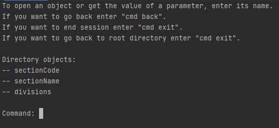

## Simple json navigator
**A module that allows you to explore the structure of json files using the console interface.** 

#### Start
1) All needed libraries for the projects you can find in requirements.txt
2) Open main.py
3) Run main.py

#### Using
1) Enter path to json file you want to open
2) Read the shown instruction and explore the file

#### Commands
1) Enter directory name you want to open
2) Use commands to more actions:
- "cmd back" to go back one directory
- "cmd exit" to stop file
- "cmd dir_name_len *parameter*" to change length of dicts/list names. In the parameter enter length. For example: cmd dir_name_len 20
- "cmd root" if you want to back to root directory

#### Screenshots

